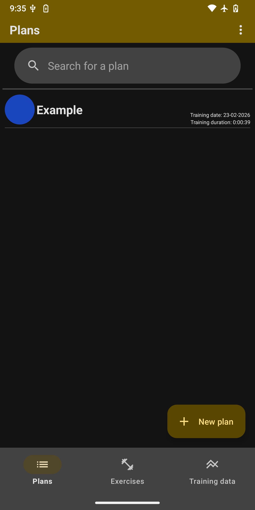
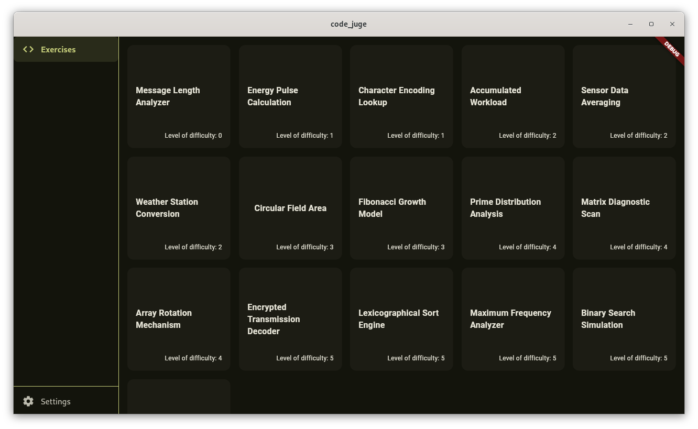

## Hello World 👋
I'm a German student and since I'm really into programming I spend a lot of time working on my projects.
So far **I learned C, Java, Flutter and a little bit about the way Linux and Android work**. These are my repositories:

- **[GymTrim](https://github.com/naibaf-1/GymTrim):** *A nice gym application for Android*
- **[CodeJudge](https://github.com/naibaf-1/CodeJudge):** *A simple code judge using C and Flutter, which simulates exams*
- **[GNOME-Wallpaper-Collection](https://github.com/naibaf-1/GNOME-Wallpaper-Collection):** *A collection of nice wallpapers*

I want to collaborate on some nice projects, because **I want to show and improve my skills**. At the moment I'm also diving into some nice AI stuff, by **contributing to the [gluck-bot](https://github.com/Willibald-Gluck-Gymnasium/gluck-bot)** of the [Willibald Gluck Gymnasium](https://github.com/Willibald-Gluck-Gymnasium).
However: I'm still working on my projects listed above, so if you want to help me, **feel free to contribute** some nice wallpapers to my collection or contribute to GymTrim or CodeJudge. I'm glad if people report issues or if they even contribute, because it shows that my projects are actually useful.

### 👨‍💻 About me
- German student
- Interested in programming, Linux, Android and open-source
- Building useful apps and tools

### 🧰 Tech Stack
**C** (memory basics, algorithms, CLI tools,...) • **Java** (Android, OOP) • **Dart & Flutter** (UI, state management, cross platform) • **Linux** (daily driver, distros tested) • **Android** (App development, ROMs tested) • **Git**

| 🚀 What I'm working on | 🤝 How to support my work |
|----------------------------|---------------------------|
| - Improving GymTrim & CodeJudge | - Report issues |
| - Creating new wallpapers | - Contribute wallpapers |
| - Contributing to gluck-bot | - Suggest features |
| - Interesting projects | - Star and fork my repositories ⭐ |
| - Learning more about the languages and frameworks I use | |
| - Learning Linux by using it (so far I tried Manjaro, Ubuntu, Debian, ...) | |
| - Learning more about Android by using custom ROMs (e.g. LineageOS) | |

### 🎯 Goals
- Collaborate on open-source projects
- Improve my frontend as well as backend skills
- Make projects which are actually useful

### 📦 Repositories
##### 📱 GymTrim

##### 🖥️ CodeJudge

##### 🖼️ GNOME-Wallpaper-Collection

 

 

### 👥 Contact
If you want to contact me, you can do so via this mail address: Roland.Fabian@pm.me
